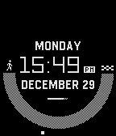
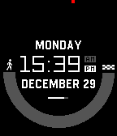
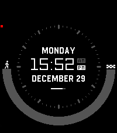

# Constellation

A Pebble watchface inspired by Starfield.

## Screenshots

### Pebble Time Round

### Pebble/Steel/2

### Pebble Time/Time Steel

### Pebble Time 2

## Store
[Pebble App Store](https://apps.rebble.io/en_US/application/695299cfda150100090722b8)

## Features

- **Time Display**: Large, easy-to-read time with day, date, and AM/PM indicators
- **Step Tracker**: Visual arc display showing daily step progress with customizable goal
- **Battery Indicator**: Real-time battery level display
- **Second Ticker**: Optional animated second indicator (can be hidden via settings)
- **Splash Screen**: Customizable startup logo (black & white, color, none)
- **Multi-Platform**: Supports all Pebble watches (Aplite, Basalt, Chalk, Diorite, Emery, Flint)

## Configuration Options

Access watchface settings through the Pebble app on your phone:

1. **Show Second Ticker**: Toggle the animated second indicator on/off
2. **Step Goal**: Set your daily step target (1,000 - 50,000 steps)
3. **Splash Logo Style**: Choose between black & white, color or no splash logo
