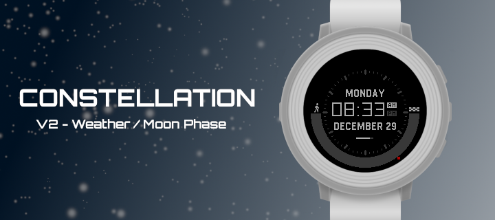
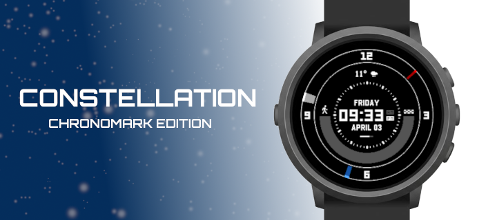
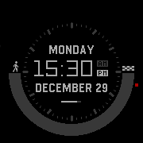
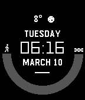
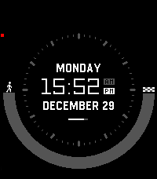
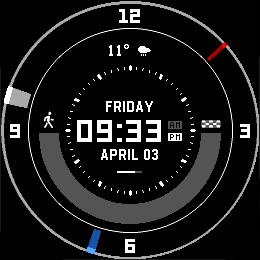

# ★ Constellation

A Starfield-inspired watchface for Pebble smartwatches. Two editions built from shared code.




## Editions

### Standard Edition

> Supports all Pebble watches — Aplite, Basalt, Chalk, Diorite, Emery, Flint, Gabbro (scaled)

[Rebble App Store](https://apps.rebble.io/en_US/application/695299cfda150100090722b8)

| Pebble Time Round | Pebble Time / Time Steel | Pebble Time 2 |
|:--:|:--:|:--:|
|  |  |  |

### Chronomark Edition

> Made for Pebble Time Round 2 (gabbro)

[Rebble App Store](https://apps.rebble.io/en_US/application/69d01934afd8430009d9a1e8)

| Pebble Time Round 2 |
|:--:|
|  |

## Features

- **Time Display** — Large, easy-to-read time with day, date, and AM/PM indicators
- **Analog Clock Ring** — Optional outer ring with hour/minute/second tickers (Chronomark)
- **Weather** — Current conditions with Celsius or Fahrenheit
- **Moon View** — Current moon phase with sunrise/sunset times
- **Step Tracker** — Visual arc showing daily step progress toward a configurable goal
- **Distance Walked** — Metric or imperial distance display
- **Heart Rate** — Live BPM readout (Standard Edition, supported hardware only)
- **Battery Indicator** — Real-time battery level
- **Second Ticker** — Optional animated second indicator
- **Splash Screen** — Customizable startup logo with multiple faction themes
- **Configurable Modules** — Top and bottom info slots with selectable formats

## Setup

**Requires**: [Pebble SDK v3](https://developer.rebble.io/developer.pebble.com/sdk/install/index.html) (toolchain 4.9.127)

```bash
# Clone and set up symlinks (required before first build)
git clone <repo-url>
cd constellation
bash setup.sh
```

## Build

Build both editions in parallel:

```bash
bash build.sh
```

Or build a single edition:

```bash
cd standard-edition && pebble build
cd chronomark-edition && pebble build
```

Clean build (required after adding/removing message keys):

```bash
cd standard-edition && pebble clean && pebble build
```

## Install

```bash
# Emulator
pebble install --emulator basalt       # Standard
pebble install --emulator gabbro       # Chronomark

# Physical watch
pebble install --phone <IP>
```

## Architecture

```
constellation/
├── shared/                          ← Code & resources shared between editions
│   ├── src/c/
│   │   ├── shared_modules/          ← battery, top, bottom, weather_display, splash_logo
│   │   └── utilities/               ← date_format, weather, logos
│   └── resources/
│       ├── weather/                  ← Weather icon PNGs
│       └── splash_logos/             ← Faction logo PNGs
│
├── standard-edition/                ← Aplite, Basalt, Chalk, Diorite, Emery, Flint
│   └── src/c/
│       ├── constellation.c          ← Main app
│       ├── modules/                 ← step_tracker, sun_tracker, moon_view
│       ├── shared_modules/ → symlink
│       └── utilities/ → symlink
│
├── chronomark-edition/              ← Gabbro (Pebble Time Round 2)
│   └── src/c/
│       ├── constellation.c          ← Main app
│       ├── modules/                 ← outer_ring, step_tracker, sun_tracker
│       ├── views/                   ← moon_view
│       ├── shared_modules/ → symlink
│       └── utilities/ → symlink
│
├── setup.sh                         ← Creates symlinks from shared/ into editions
└── build.sh                         ← Parallel build script for both editions
```

Shared modules use parameterized `init()` functions — layout-specific values (Y offsets, resource IDs) are passed by each edition's `constellation.c`. This keeps a single source of truth while allowing different layouts per edition.

Settings UI uses [@rebble/clay](https://github.com/nickswalker/clay) with per-edition `config.json` and `custom-clay.js` files.

## Configuration

Access settings through the Pebble/Rebble app on your phone:

| Setting | Standard | Chronomark |
|---------|:--------:|:----------:|
| Second Ticker | ✓ | ✓ |
| Step Goal | ✓ | ✓ |
| Step Tracker | ✓ | ✓ |
| Splash Logo Style | ✓ | ✓ |
| Weather (on/off, °C/°F) | ✓ | ✓ |
| Moon View | ✓ | ✓ |
| Top/Bottom Module Format | ✓ | ✓ |
| Distance (km/mi) | ✓ | ✓ |
| Heart Rate | ✓ | — |
| Clock Ring Style | ✓ | — |
| Tracker Style | ✓ | — |
| Analog Clock | — | ✓ |
| Decorative Ring | — | ✓ |
